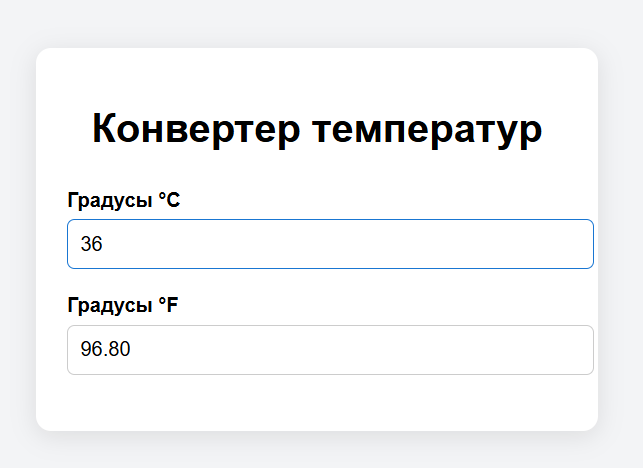
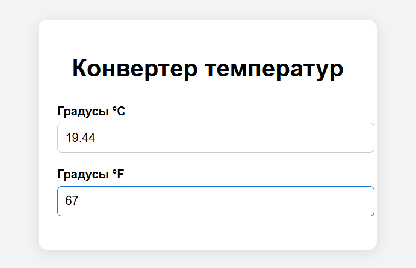

# Temperature Converter (°C ↔ °F)

Простое React-приложение для конвертации температур между градусами Цельсия (°C) и Фаренгейта (°F).
---
## 🔧 Функциональность

* Ввод значения в °C автоматически пересчитывает значение в °F
* Ввод в °F пересчитывает в °C
* Проверка корректности данных
* Реализация на функциональных компонентах React
* Управление состоянием через `useState`
---
## 📸 Скриншоты

